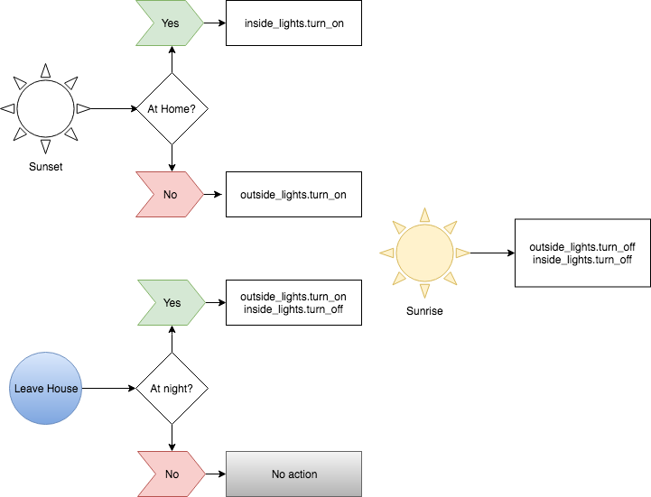

# Home Assistant Configuration

This repo represents the [Home Assistant](https://www.home-assistant.io/) (HASS) configuration files I created to handle home automation tasks. The ultimate goal of this project is to automate common household tasks and have control of the devices via [Amazon Alexa](https://developer.amazon.com/alexa).

## Automation Overview

### Lights

